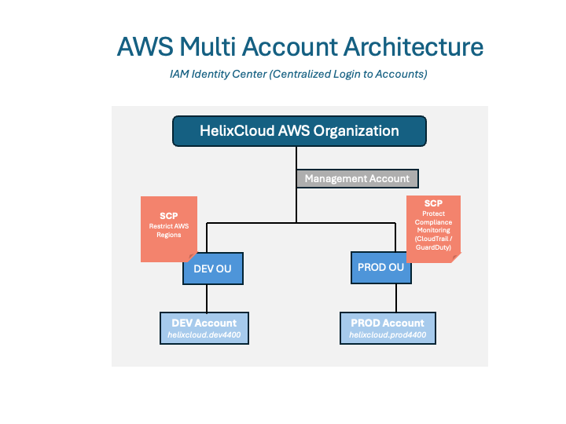

## AWS Multi Account Architecture Lab

- This project demonstrates an enterprise-style AWS multi-account environment using -
AWS Organizations, Service Control Policies (SCP), IAM Identity Center and Terraform.
---

## Organization Scenario

- The lab simulates a cloud organization **HelixCloud** with centralized governance, account isolation & role-based access management across multiple AWS accounts.
---

## Organization Structure

1. Management Account --> cloud.platform.eng
2. Dev Account --> helixcloud.dev4400 
3. Prod Account --> helixcloud.prod4400
---

## Architecture

---

## Technologies Used

- AWS Organizations --> used for multi-account management/governance
- IAM Identity Center --> centralized authentication
- SCP (Service Control Policies) --> centralized policy enforcement across accounts
- Terraform --> infra-as-code implementation
- Amazon S3 --> used to maintain versioning of terraform state file
- Amazon DynamoDB --> used to maintain the terraform lock file
- AWS IAM --> access and permission management

## Features Achieved

* AWS Organizations-based multi-account structure
* Organizational Units for Dev and Prod
* Service Control Policies for governance
* Terraform-managed infrastructure
* Remote Terraform backend with S3 and DynamoDB
* Centralized identity approach using IAM Identity Center

## Objective

- The goal of this project is to simulate enterprise cloud governance with centralized access control, and Infrastructure as Code practices.
